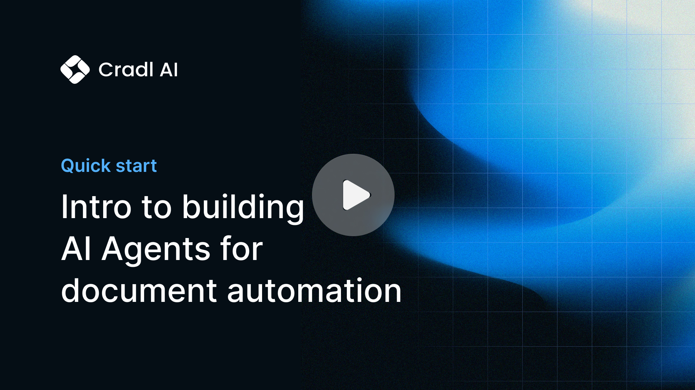

**Cradl AI** is a no-code platform to build and implement AI agents that autonomously process complex documents, freeing your team from repetitive manual tasks.

## Who Cradl AI is (and isn't) for

1. Cradl AI is designed for businesses of all sizes - from solo entrepreneurs and freelancers to small businesses and teams within large, public companies. While most of our customers work at companies with 1 to 500 employees, we also support Fortune 500 enterprises with complex procurement processes and strict compliance requirements.
2. Cradl AI is built for users of all technical backgrounds. Our mission is to provide the most intuitive and user-friendly document automation platform for **citizen developers** — so you don’t need to know anything about JSON, APIs, or LLMs to get value from Cradl AI.

   If you’re more technically inclined, you’ll find plenty of flexibility too. We support custom code, webhooks, HTTP requests, and more - giving you the control you need without unnecessary complexity.

   However, if you’re looking for an open-source tool to self-host and manage entirely through code, Cradl AI probably isn’t the best fit.

## Here are some of the features that Cradl AI offers:

Update your docs to your brand and add valuable content for the best user conversion.

<CardGroup cols={2}>
  <Card title="AI Agents" icon="sparkles" href="/core-concepts/ai-model">
    Build customized AI models to parse structured information from any document.
  </Card>
  <Card title="Human in the loop" icon="user-check" href="/core-concepts/human-in-the-loop">
    Route low-confidence predictions to a dedicated human review UI.
  </Card>
  <Card title="Integrations" icon="link" href="/">
    Easily connect your AI Agent to your existing workflows via APIs, email, or automation tools
  </Card>
  <Card title="Insights" icon="chart-waterfall" href="/">
    Monitor and stay in control of your automation with a dedicated dashboard.
  </Card>
</CardGroup>